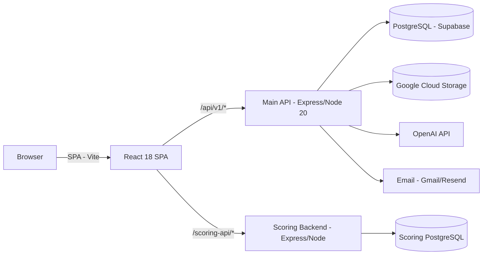

# Sportzicon — Architecture

Monorepo, three independently deployable services: main API, main SPA, scoring subsystem.



## Backend module system

Every feature lives in `backend/src/modules/<name>/` with three files:
- `<name>.routes.ts` — Express Router, middleware, `asyncHandler` wrappers
- `<name>.service.ts` — business logic, repositories, EventBus emissions
- `<name>.schemas.ts` — Zod schemas

16 modules: auth, users, organizations, opportunities, applications, posts,
reels, blogs, follow, messaging, notifications, search, media, ai,
verification, admin, email-logs.

## Application state machine

```
pending → shortlisted → selected
   │           │
   └────► rejected
   │           │
   └──► withdrawn ◄┘
```

Enforced in `backend/src/lib/StateMachine.ts`. Selecting decrements
opportunity vacancies; withdrawing/rejecting from `shortlisted` restores
the opportunity to `open` if it had filled.

## Frontend layer model

```
pages/    → hooks only (no useQuery/axios directly)
hooks/    → useQuery/useMutation + cache invalidation
services/ → typed axios methods
models/   → TypeScript interfaces only
```

Feature-sliced under `frontend/src/modules/<name>/`; shared kernel
(components, hooks/queryKeys.ts, services/index.ts, store, api, utils)
stays in the root dirs.

See root [README.md](../README.md) for tech stack, quick start, and
deployment details.
