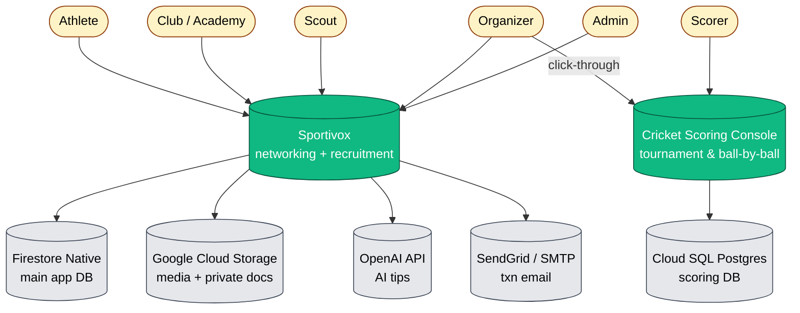
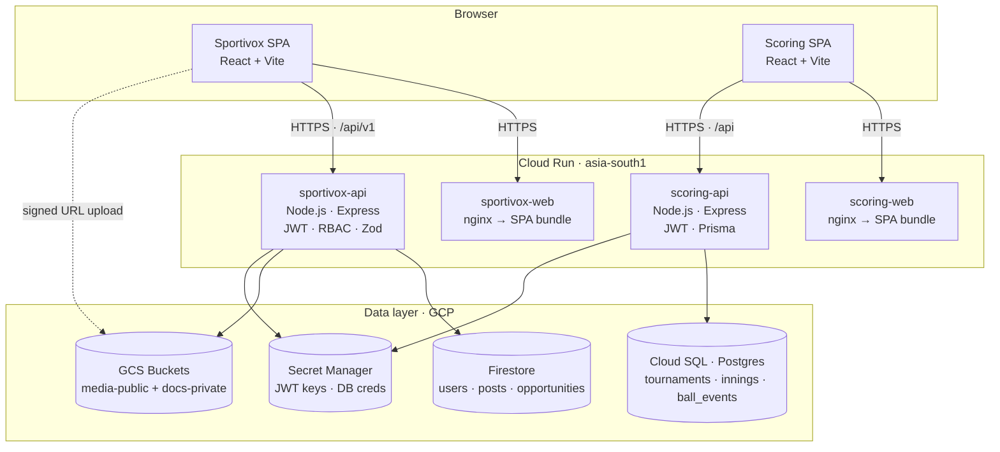
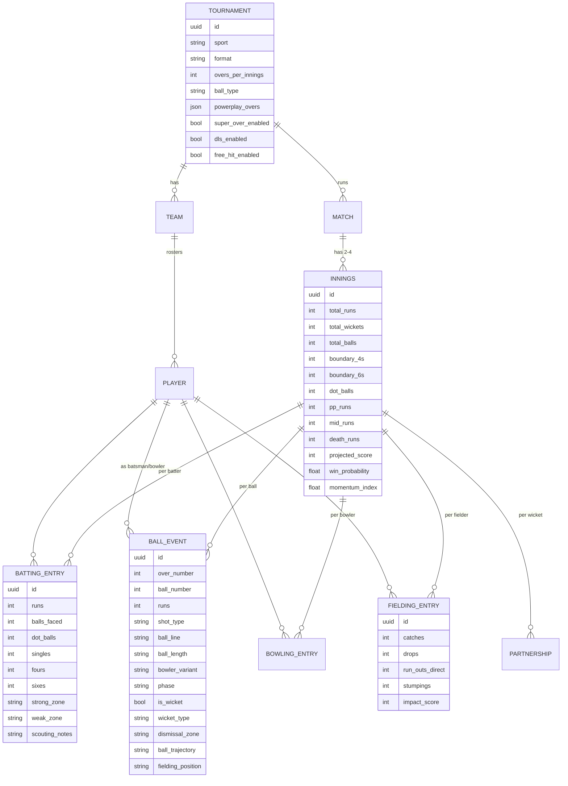
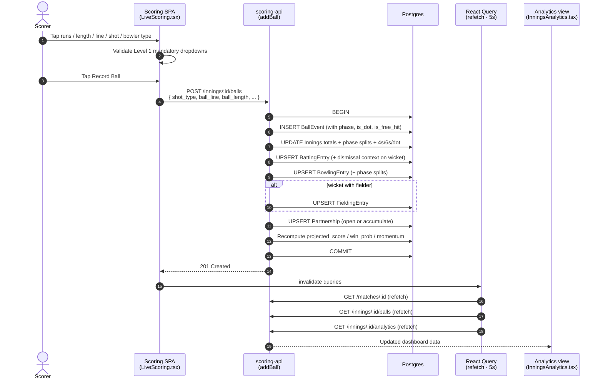
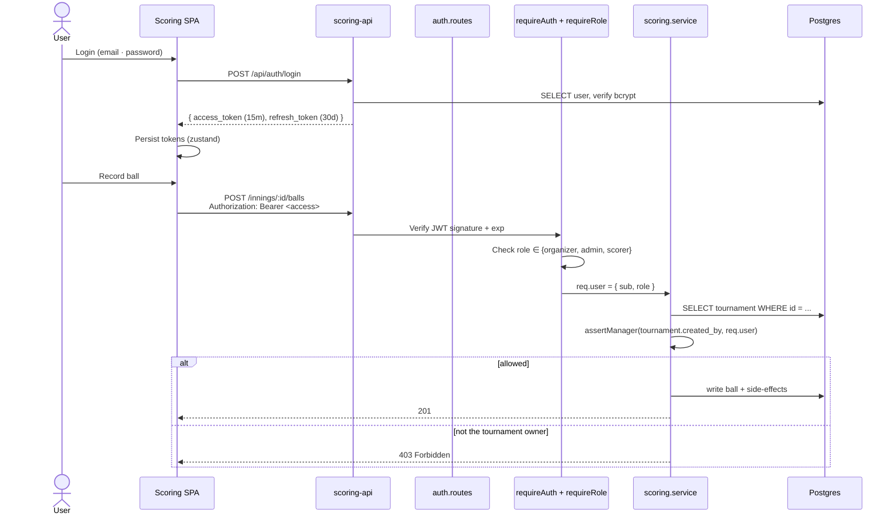
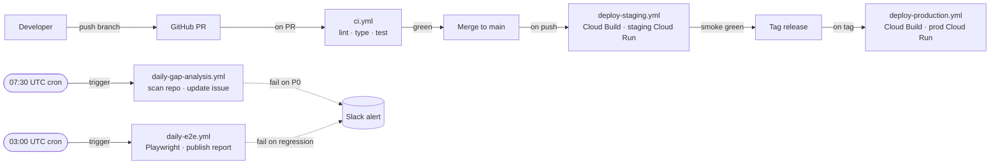
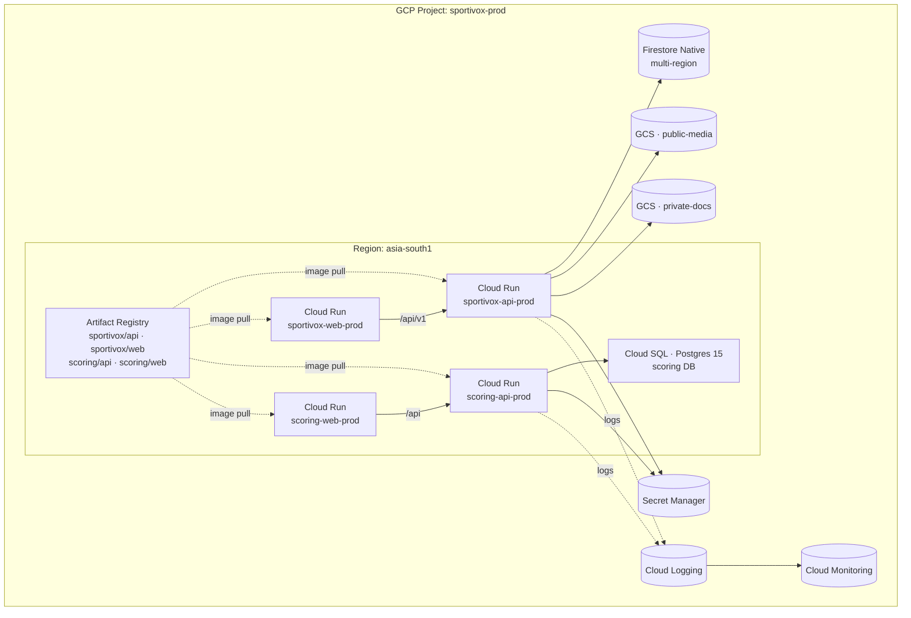
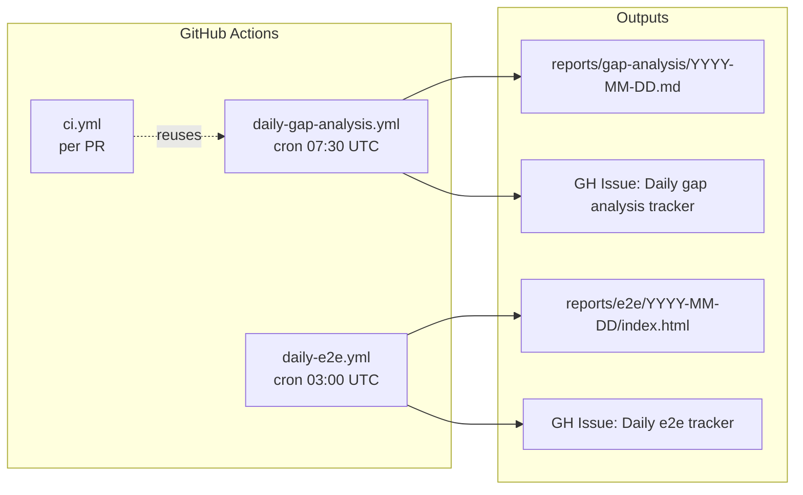
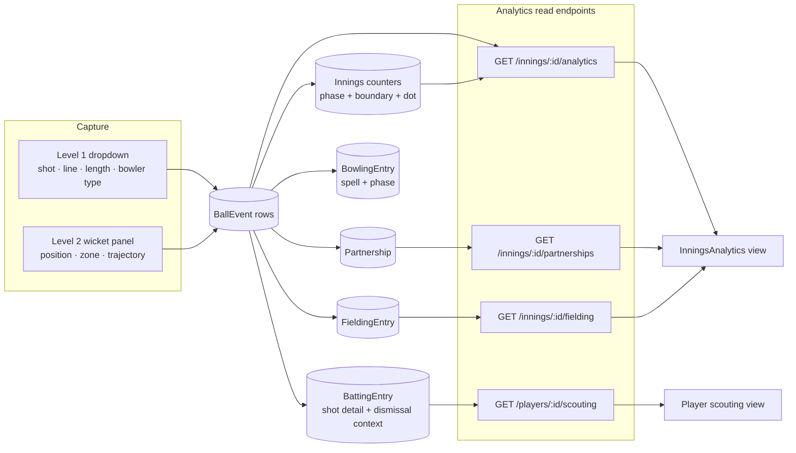

# Sportivox — Architecture Diagrams

Comprehensive set of Mermaid diagrams covering the system topology, data flow, deployment topology, and the new cricket scoring sub-system from the PPTX (cricket_features_parameters.pptx, May 2026).

GitHub renders Mermaid blocks natively — open this file on github.com to see the diagrams.

---

## 1 · System context (C4 Level 1)

Who uses Sportivox and what external systems it talks to.

Notes
- The two systems sit side-by-side rather than nested. The Sportivox networking app is Firestore-based; the cricket scoring console is a Postgres-based ball-by-ball OLTP workload. Different access patterns, different DBs.
- Organizers cross the boundary via a deep link on the Tournaments page (env var `VITE_SCORING_URL`).

---

## 2 · Container diagram (C4 Level 2)

The deployable units and how requests flow between them.

---

## 3 · Cricket scoring — data model (post-PPTX rollout)

Entities owned by the scoring Postgres schema after the PR adds the PPTX features.

---

## 4 · Live scoring — ball-by-ball write flow

What happens between a scorer tapping "Record Ball" and the analytics view updating.

Notes
- Each `addBall` is a single DB round-trip from the client's perspective. Internally it touches up to 5 rows (`Innings`, `BattingEntry`, `BowlingEntry`, `FieldingEntry`, `Partnership`) — fine at the cricket-scoring throughput (1 ball every ~30s in real life).
- `Undo` is symmetric — the same handler decrements every counter the matching `addBall` incremented and deletes the `BallEvent` row last.

---

## 5 · Authentication & RBAC flow

How a scorer's request reaches the database and gets authorised.

---

## 6 · CI/CD pipeline

How code reaches production.

---

## 7 · Deployment topology (GCP)

What lives where in the cloud.

---

## 8 · Daily automation overview

How the three automated processes (added in this PR) fit together.

The reports get committed back to the `reports/` directory on main so history is searchable in git. A single rolling GitHub issue per area keeps the noise down (no daily issue spam).

---

## 9 · Data flow — analytics read path

Where the analytics dashboard gets its numbers.

Everything analytics needs is computed at write-time and read O(1). The only cross-cutting read query is `length × line` for the pitch map, which is a single aggregate over `BallEvent` rows for one innings (≤ 240 rows for a T20, indexable).

---

## 10 · Where to look when something breaks

| Symptom | Likely component | First file to open |
|---|---|---|
| "I can't score a ball" | Scoring API auth | `scoring/backend/src/middleware/auth.ts` |
| Stats look wrong after a ball | `addBall` derivation | `scoring/backend/src/modules/scoring/scoring.service.ts` |
| Pitch map shows zeros | BallEvent missing `ball_length`/`ball_line` | check Level 1 was selected on the ball form |
| Win probability stuck | `winProbability` heuristic edge case | same file, search for `function winProbability` |
| Organizer can't open scoring | Cross-app link | `frontend/src/pages/Tournaments.tsx` + `VITE_SCORING_URL` env |
| CI passed but prod broke | Staging skipped | `.github/workflows/deploy-staging.yml` |
